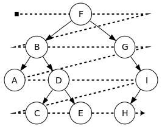

# TRABALHO FUNDAMENTOS DE SISTEMAS INTELIGENTES ⌨
##  O trabalho consiste em implementar um sistema de navegação automática de um agente utilizando o algoritmo de busca em **largura, profundidade, gulosa e AEstrela**
***********

## [Descrição do trabalho](docs/TrabalhoBusca.pdf)
***********

# Algoritmos
## Sem Informação
* Busca em Largura (BFS)

  

* Busca em Profundidade (DFS)

  

## Com Informação
* Busca Gulosa 

* Busca A*

***********
## Comparações entre os algoritmos de busca 

Algoritmos  | Completa? | Tempo       | Espaço    | Ótima? |
:----------:|:---------:|:-----------:|:---------:|:------:|
BFS         | 
DFS         | 
Gulosa      | 
A*          | 
***********

# Detalhes sobre o Trabalho

## Legendas

Simbolo   | Descrição
:-------: | ------------------
1         | Caminho vale 1
4         | Caminho vale 4
10        | Caminho vale 10
20        | Caminho vale 20
p         | Parede
R         | Recompensa

***********

## Mapa ultilzido para a busca BFS e DFS
  0 | 1 | 2 | 3 | 4 |
:--:|:-:|:-:|:-:|:-:|
 1  | 1 | 10| 20| 0 |
20  |"p"|"p"| 1 | 0 |
1   | 1 | 4 | 1 |"R"|
1   |"p"|"R"|20 |10 |
10  |"p"|"p"| 1 | 4 |
1  | 1  |20 |"F"|"p"|

***********

## Mapa ultilzido para a busca Gulosa e A*
  0 | 1 | 2 | 3 | 4 |
:--:|:-:|:-:|:-:|:-:|
 1  | 1 | 10| 20| 0 |
20  |"p"|"p"| 1 | 0 |
1   | 1 | 4 | 1 |"R"|
1   |"p"|"R"|20 |10 |
10  |"p"|"p"| 1 | 4 |
1  | 1  |20 |"F"|"p"|

***********
***********

